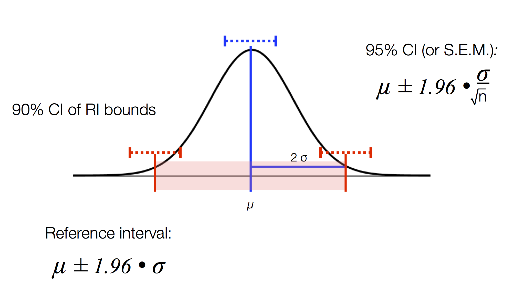

```{r setup, include=FALSE}
knitr::opts_chunk$set(echo = TRUE, comment=NA)
library(tidyverse)
library(readxl)
```

# Method Validation in R: Reference Ranges

## Overview

In this section we will walk through examples of how to use R to analyze standard method validation experiments, beginning with reference range evaluation. 

We will use real data acquired as part of a method transition for immunoassays (unconjugated estriol, alpha fetoprotein, and inhibin-A) used for prenatal risk assessment for Trisomy 21, Trisomy 18, and open neural tube defects.

Relatively "clean" data has already been organized in separate tabs in an excel document. 

## Load data

First, let's look at the data in our spreadsheet program

### How to load data?

Here's a graphical representation of how a function such as `read_excel` can assign values to a new object:

{width=450px}

### How does read_excel work?

Click the green arrow to execute this code chunk:

```{r explore_function, eval=FALSE}
?read_excel
```

We see that there are three different functions grouped together, a `read_excel` function that is a wrapper for two more specific functions `read_xls` and `read_xlsx`. Since our Excel document is in .xlsx format, we can either use the general `read_excel` or `read_xlsx` function. We need to specify the path to our excel file and the worksheet we would like to load in. Here is an example:

### Example: Load Method Evaluation data

Let's first load one of these data sets. To do this we will use the `read_excel` function. We need to specify the path to our excel file and the worksheet we would like to load in. Below is an example, which does the following: 

 1. R uses the `read_excel` function to open a excel spreadsheet located on the `path` "data/Method_Validation.data.xlsx".
 2. We specify a `sheet`, which corresponds to the worksheet name (the 'tabs' in the lower left when you open an excel sheet).
 3. The result is *assigned* via the `<-` operation (also known as the assignment operator) to the object to the left of the assignement operator.

```{r example_data_load}
uE3 <- read_excel(path="data/Method_Validation.data.xlsx", 
                sheet="MS uE3")
uE3  # Take a peak
```

**Exercise 1:**
Load in the alpha fetoprotein (AFP) method comparison data into a tibble named `afp`

```{r load_data_1, echo=FALSE}
afp <- read_excel(path="data/Method_Validation.data.xlsx", 
                sheet="MS AFP")
afp
```

**End exercise**

What is a path? 

- *Paths describe the location of a file in a filesystem (e.g., your computer, a network drive, etc.). In this case, we are telling the function `read_excel` the location of our file, and the name of the Excel Sheet to open.* 

- *These are called "arguments" to the function. Functions "take" arguments (or alternatively functions are "passed" arguments).*

### More on data importing
What about reading other sorts of data? [Check out the R **cheat sheet** specifically for importing data](https://github.com/rstudio/cheatsheets/raw/master/data-import.pdf).

Other cheat sheets exist as well, [check them out here](https://www.rstudio.com/resources/cheatsheets/)

## Viewing data tables

### QC data import
Once you have loaded some data into an R object (in this case, `afp`), you should always briefly visually and manually inspect it. Things to check for include:

 - Did the variable names import properly?  [Need to be able to refer to each variable]
 - Did variables get split appropriately [Do we have the right number of columns?]
 - Did any lines (observations) get skipped? Did the entire file get loaded?

### Discuss the tbl data structure
Let's next take a look at the data we have now saved as `afp`. We can do this in a few different ways.

```{r}
afp
```

Note that it looks very similar to its original form in Excel. There are 3 columns and 161 rows. Each column has a specfic data format (`chr`, `dbl`, etc.). The `read_excel` function assigned these automatically. For our purposes, it is important that our result columns are numeric (`dbl` means "double wide" and is a type of numeric data format).

There are a few ways to examine an object in R:

1. Printing the contents to the console by simply executing a line with the object's name (as above)
2. In R-Studio, objects can also be _inspected_ using the "Environment" tab (usually in the top right pane). 

**Exercise 2:** 
Click on `afp`.
**End exercise**

### Look at head of table

A quick way to look at only the top `n` rows is using the `head` function:
```{r}
head(afp, n=3)     # top 3 rows
```

- Any text following a "#" is considered a "comment" in R, and **is not part of the code**. 
- You can use comments to help explain to others (or future-you) what a particular section of code is doing, or to quickly "comment out" a portion of the code that you do not want to run. 

### Isolate an individual variable

We can use the `$` shorthand to isolate _individual_ variable. Note that this is no longer a table, but just an array of values.
```{r}
afp$method_a
```

## Examine data distribution

Let's focus on the maternal serum AFP values from Method A first. 

```{r basic_stats}
mean(x = afp$method_a)  # Mean
median(x = afp$method_a) # Median
sd(x = afp$method_a) # Standard deviation
```

*In calling functions (i.e. `mean`), the values can be passed in order the functions arguments, or they can be explicitly assigned (`arg` = `value`). In general, it is good practice to specify the argument receiving each value, because this is safer and easier to follow. However, because this makes statement much longer, it is common to not explicitly list arguments for common functions with few, easily interpretable arguments. As an example, since `mean` and `sd` only take single values, we can simply write and read:*

```{r basic_stats_shorter}
mean(afp$method_a)  # Mean, shorter
sd(afp$method_a) # Standard deviation
```

**Exercise 3:**
Using the functions `mean` and `sd`, write code that will calculate the Coefficient of Variation (CV) for the assay. Hint: The CV is defined as:

\[
CV(\%) = \sigma/\mu * 100
\]

```{r, eval=FALSE}
cv <- XXXXX
print(cv)
```

```{r, echo=FALSE}
cv <- sd(afp$method_a) / mean(afp$method_a) * 100  # Coefficient of variation
print(cv)
```

**End exercise**

## Is it normally distributed?
There are many approaches to determining "normality" of a distribution. Calculation of mean, median, mode and SDs can help. Visual inspection of the data will also quickly reveal if the data is normal, skewed, multimodal, etc. 

> A famous example of how summary statistics can mask true differences is demonstrated by Anscombe's quartet. FJ Anscombe, an English statistician, famously said in 1973 that "Computers should make both calculations and graphs. Both sorts of output should be studied; each will contribute to understanding." An entertaining (involving T-rex) and informative visualization of this problem can be found here: https://www.autodeskresearch.com/publications/samestats

We will use the `ggplot` library to visualize data.

> The idea of ggplot is to use graphical "building blocks" and combine them to create just about any kind of graphical display you want. Here is an [in-depth tutorial of ggplot](https://tutorials.iq.harvard.edu/R/Rgraphics/Rgraphics.html).

``` {r}
ggplot(data=afp) +
  geom_histogram(aes(x=method_a))
```

What's going on here? Take a look at this visual breakdown:

{width=450px}

**Exercise 4:**
1. Make a second histogram plotting `method_b` values. Select reasonable `binwidth` or `bins`.

``` {r, eval=FALSE}
ggplot(data=XXXXXXX) +
  geom_histogram(bins=XXX, binwidth=XXX, aes(x=XXXXXXXX))
```

``` {r, echo=FALSE}
ggplot(data=afp) +
  geom_histogram(binwidth = 10, aes(x=method_b))
```

Does it look normal? 

2. Transform the x-axis to log-scale using `scale_x_log10` and visually inspect for normality

```{r, eval=FALSE}
ggplot(data=afp) +

```

```{r, echo=FALSE}
ggplot(data=afp) +
  geom_histogram(bins=15, aes(x=method_a)) +
  scale_x_log10()   # Change x-axis scaling
```

**End exercise**

How can we quantify this?

The **skew** and **kurtosis** are so-called **moments** of a distribution and can be used as measure of normality (or non-normality).

```{r}
library(moments)            # load the moments R library, which provides the functions
skewness(afp$method_a)
kurtosis(afp$method_a)
```

**Exercise 5:**
Let's assess the `skewness` of the log-transformed method_a data. Use the `log10` function to transform results.

```{r, echo=FALSE}
method_a_logged <- log10(afp$method_a)
skewness(method_a_logged)
```

**End exercise**

Another option is to use the **Shapiro-Wilk test of normality**:

```{r}
shapiro.test(afp$method_a)
```

## Establishing a reference range

### Overview
Reference ranges can be established in several different ways. Two of the most common approaches are termed **parametric** and **non-parametric**. 

| |Parametric|Non-parametric|
|:-------------|:-------------------------:|:-------------------------:|
|Good for|Normal distributions|Skewed, log-normal, or other non-normal distributions|
|Assumptions|Assumes normality|No assumptions about underlying distribution|
|Center of distribution|Mean|Median|
|Advantages|More power|Less affected by outliers, Simple to calculate|
|Disadvantages|Affected by outliers + skew|Less power, requires more samples|
|CLSI Recommended Approach|No|Yes|

### Parametric Reference Ranges

{width=350px}

\[
range = \mu ±1.96* \sigma
\]
Where $\mu$ is the mean (average) of the distribution and $\sigma$ is the standard deviation.

We can calculate these for our results in `method_a` using R:

```{r}
mu <- mean(afp$method_a)
sigma <- sd(afp$method_a)

lower_bound <- mu - 1.96 * sigma
upper_bound <- mu + 1.96 * sigma

sprintf("The reference range assuming normal distribution is (%f, %f)", lower_bound, upper_bound)
```

**Exercise 6:**
Calculate the parametric reference range assuming that the results are log-normal (rather than normally distributed). Hint: First transform the data as above with the `log()` function, and then "untransform" back into real numbers with `exp()`

```{r, eval=FALSE}
mu <- mean(______________)
sigma <- sd(______________)

lower_bound_transformed <- mu - 1.96 * sigma
upper_bound_transformed <- mu + 1.96 * sigma

lower_bound_untransformed <- ______________________
upper_bound_untransformed <- _____________________

sprintf("The reference range assuming log-normal distribution is (%3.1f, %3.1f)", 
        lower_bound_untransformed, upper_bound_untransformed)
```

```{r, echo=FALSE}
mu <- mean(log(afp$method_a))
sigma <- sd(log(afp$method_a))

lower_bound_transformed <- mu - 1.96 * sigma
upper_bound_transformed <- mu + 1.96 * sigma

lower_bound_untransformed <- exp(lower_bound_transformed)
upper_bound_untransformed <- exp(upper_bound_transformed)

sprintf("The reference range assuming log-normal distribution is (%3.1f, %3.1f)", lower_bound_untransformed, upper_bound_untransformed)
```

**End exercise**

To visually inspect, let's graphically show the bounds of the reference intervals on the histogram we made above. A simple way to do this is to use the `geom_vline` function of ggplot. 
- Start with with the code for the histogram above, add additional lines of code to display the bounds of the parametric reference interval. (*Hint: Remember that ggplot allows you to "add" new elements to a plot*)

```{r}
# Code from exercise answer above
mu <- mean(log(afp$method_a))
sigma <- sd(log(afp$method_a))
lower_bound_transformed <- mu - 1.96 * sigma
lower_bound_untransformed <- exp(lower_bound_transformed)

# new code to plot
ggplot(data=afp) +
  geom_histogram(bins=50, aes(x=method_a)) +
  geom_vline(xintercept=lower_bound_untransformed, color="blue")
```

**Exercise 7:**
Add the additional 3 bounds we have just calculated to this plot. Change to a dashed line by specifying `linetype` in the `geom_vline` function.

  1. Look up the function call for `geom_vline`. What kind of arguments does it take? 
  2. Start with with the code for the histogram above, add additional lines of code to display the bounds of the parametric reference interval. (_Hint: ggplot allows you to "add" new elements to a plot_)

```{r, eval=FALSE}
g <- ggplot(data=afp) +
  geom_histogram(bins=50, aes(x=method_a)) +
  geom_vline(xintercept=lower_bound_untransformed, ___________, color="blue") +
  geom_vline(_____________) +
  geom_vline(_____________) +
  geom_vline(_____________)
g
```

```{r, echo=FALSE}
g <- ggplot(data=afp) +
  geom_histogram(bins=50, aes(x=method_a)) +
  geom_vline(xintercept=lower_bound_untransformed, linetype=3, color="blue") +
  geom_vline(xintercept=upper_bound_untransformed, linetype=3, color="blue") +
  geom_vline(xintercept=lower_bound, linetype=3, color="red") +
  geom_vline(xintercept=upper_bound, linetype=3, color="red")
g
```

**End exercise**

### Non-parametric Reference Ranges
Non-parametric reference ranges are simply the middle 95% of the distribution. Using R, this is done with the straightforward command `quantile`:

```{r}
non_parametric_bounds <- quantile(x=afp$method_a, probs = c(0.025, 0.975))
print(non_parametric_bounds)
```

Can we verify that the `non_parametric_bounds` includes 95% of the data? Sure thing! We will do this with some new operations and a feature in R called masking. First we need to be able to refer to each bound separately. Don't want to get lost in the weeds here, but there are several different ways of extracting elements of the vector `non_parametric_bounds`

```{r}
non_parametric_bounds
non_parametric_bounds[1]
non_parametric_bounds[[1]]
non_parametric_bounds[["2.5%"]]
```

Let's first ask which elements of `method_a` are greater than our lower-bound?
```{r}
mask <- afp$method_a > non_parametric_bounds[[1]]
mask
```

The result is a boolean (TRUE/FALSE) array. Then lets combine our upper and lower bounds
```{r}
mask <- (afp$method_a > non_parametric_bounds[[1]]) & 
                (afp$method_a < non_parametric_bounds[[2]])
mask
```

This intermediate data structure `mask` is convenient, because we can easily ask how many elements it contains and how many are `TRUE`:
```{r}
length(mask)
sum(mask == TRUE)
proportion_in_range = sum(mask == TRUE) / length(mask)
print(proportion_in_range)

#Alternative
sum(mask) / length(mask)
```

**Exercise 8:**
Plot these proposed reference intervals on histogram

```{r, eval=FALSE}
ggplot(data=afp) + 


```

```{r, echo=FALSE}
ggplot(data=afp) +
  geom_histogram(bins=50, aes(x=method_a)) +
  geom_vline(xintercept = non_parametric_bounds["2.5%"], color="red", linetype=3) +
  geom_vline(xintercept = non_parametric_bounds["97.5%"], color="red", linetype=3)
```
**End exercise**

## How to verify a proposed reference range?

The lab had previously used a reference range of 20-100 for this particular test. 

```{r}
g <-  ggplot(data=afp)
g <- g + geom_histogram(bins=50, aes(x=method_a))
g <- g + geom_vline(xintercept = 20, color="red", linetype=3)
g <- g + geom_vline(xintercept = 100, color="red", linetype=3)
g
```

Is this range appropriate for our observed results?
```{r}

n_samples <- length(afp$method_a)

old_range <- c(20, 100) #proposed range
n_inrange <- sum(afp$method_a >= old_range[1] & 
                   afp$method_a <= old_range[2])

chisq.test(c(n_inrange, n_samples - n_inrange), p=c(0.95, 0.05))
binom.test(x=n_inrange, n=n_samples, p = 0.95, alternative = "two.sided")

```

**Exercise 9:**
Evaluate our empirically derived parametric reference ranges

```{r, echo=FALSE}
n_samples <- nrow(afp)
ref_range <- c(lower_bound, upper_bound)
sprintf("The reference range assuming normal distribution is (%3.1f, %3.1f)",
        ref_range[1], ref_range[2])
n_inrange <- sum(afp$method_a >= ref_range[1] & 
                   afp$method_a <= ref_range[2])
binom.test(x=n_inrange, n=n_samples, p = 0.95, alternative = "two.sided")

ref_range <- c(lower_bound_untransformed, upper_bound_untransformed)
sprintf("The reference range assuming log-normal distribution is (%3.1f, %3.1f)",
        ref_range[1], ref_range[2])
n_inrange <- sum(afp$method_a >= ref_range[1] & 
                   afp$method_a <= ref_range[2])
binom.test(x=n_inrange, n=n_samples, p = 0.95, alternative = "two.sided")
```
**End exercise**

# Advanced: Using a Q-Q plot to examine a distribution
```{r}
ggplot(data=afp) + 
  geom_qq(aes(sample=method_a))
```


Are there outliers? How can you remove them?

```{r}
upper_outlier_bound <- mean(afp$method_a) + 3 * IQR(afp$method_a)

afp_removed_outliers <- filter(afp, 
                               method_a < upper_outlier_bound)
ggplot(afp_removed_outliers) + 
  geom_qq(aes(sample=method_a)) 

```
